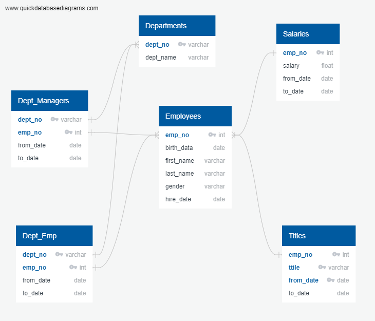

# PH_Analysis
HR data analysis of PH
### Challenge
The PH company is trying to anticipate the number of positions that they wiil have to fill out in the near future because of the people that are going to retire soon. We have been given 6 files with HR data that we had to use to perform the analysis. Utilyzing PostgreSQL database management system and SQL we created an ERD and imported data from the files. Here is the schema of our ERD:

In this challenge we had perform two-step solution:

1. To determine the total number of employees per title who will be retiring: creating a list of employees with their titles for the purpose to count the number of employees of each title. That would help us find out how many positions of each job title potentialy we would have.

2. From the list of current employees, identify those employees who are eligible to participate in a mentorship program: creating a list of employees that would meet the criteria - birthday between 1/1/1965 and 12/31/1965

While performing the firts step we created a table that contains retiring people who still work for the company. We used a few queries to join tables and clean the data

a) -- Created a new table for retiring employees (all - including those who left)
SELECT emp_no, first_name, last_name
INTO retirement_info
FROM employees
WHERE (birth_date BETWEEN '1952-01-01' AND '1955-12-31')
AND (hire_date BETWEEN '1985-01-01' AND '1988-12-31');

b) -- Created a table with the current employees that are going to retire
SELECT ri.emp_no, ri.first_name, ri.last_name, de.to_date
into current_emp
FROM retirement_info as ri
LEFT JOIN dept_emp as de
ON ri.emp_no = de.emp_no
where de.to_date = '9999-01-01';

c) -- Then we pulled in the titles and salaries
select ce.emp_no, 
	   ce.first_name, 
	   ce.last_name, 
	   tl.title, 
	   tl.from_date, 
	   s.salary
into people_titles
from current_emp as ce
inner join titles as tl
on (ce.emp_no = tl.emp_no)
inner join salaries as s
on (ce.emp_no = s.emp_no);

When we looked at the table we found out that the employees are duplicated because of many of them changed the titiles through the years. Which means that we had to take only the latest (curent) title. We used partitioning to solve the problem - found repeating employee IDs, ordered them by the starting date (from the latest to the earliest) and found the last. (P.S. in the instructions it says to use to_date which doesn't make sense because they are all currect, but from_date would be correct - so I used from_date).  

d) -- Partition the data to show only most recent title per employee
SELECT *
INTO recent_titles
FROM
 (SELECT *,
 ROW_NUMBER() OVER
 (PARTITION BY (emp_no)
 ORDER BY from_date DESC) rn
 FROM people_titles
 ) tmp WHERE rn = 1
ORDER BY emp_no;

e) --The last step is to group the employees by the titles to find how many positions of each title will be open when people retire. We also calculated an average salary which is very informative and helps understand the the rate per employee and plan the budget
select count(title), title, round(avg(salary),0) as avg_salary
into current_ret_titles
from recent_titles
group by title;

We saved these tables as csv files to provide the insights to the management

Then we performed the second step to find the employees that would be eligible to participate in the mentorship program. So we created the following queries:

-- Defining the list of employees who are aligible to participate in the mentorship program

--1. Selecting only current employees with day of birth between 1/1/1965 and 12/31/1965
select e.emp_no, e.first_name, e.last_name, e.birth_date, de.to_date
into current_emp_1965
from employees as e
left join dept_emp as de
on (e.emp_no = de.emp_no)
where (e.birth_date between '1965-01-01' and '1965-12-31')
and (de.to_date = '9999-01-01');

select * from current_emp_1965;

--2. Find out their titles to be able to count the number of employees of each title (with removing duplications)
select emp_no, first_name, last_name, title, from_date, to_date
into current_titles_1965
from
	(select ce.emp_no, ce.first_name, ce.last_name, tl.title, tl.from_date, ce.to_date,
 	row_number() over
 	(partition by (ce.emp_no)
 	order by tl.from_date desc) rn
 		from current_emp_1965 as ce
		inner join titles as tl
		on (ce.emp_no = tl.emp_no)
 	) temporarily
where rn = 1
order by emp_no;

select * from current_titles_1965;

-- Grouping by the titles:
-- Defining the list of employees who are aligible to participate in the mentorship program

--1. Selecting only current employees with day of birth between 1/1/1965 and 12/31/1965
select e.emp_no, e.first_name, e.last_name, e.birth_date, de.to_date
into current_emp_1965
from employees as e
left join dept_emp as de
on (e.emp_no = de.emp_no)
where (e.birth_date between '1965-01-01' and '1965-12-31')
and (de.to_date = '9999-01-01');

select * from current_emp_1965;

--2. Find out their titles to be able to count the number of employees of each title (with removing duplications)
select emp_no, first_name, last_name, title, from_date, to_date
into current_titles_1965
from
	(select ce.emp_no, ce.first_name, ce.last_name, tl.title, tl.from_date, ce.to_date,
 	row_number() over
 	(partition by (ce.emp_no)
 	order by tl.from_date desc) rn
 		from current_emp_1965 as ce
		inner join titles as tl
		on (ce.emp_no = tl.emp_no)
 	) temporarily
where rn = 1
order by emp_no;

The PH compaty has 1549 employees eligible for participating in the program.

-- Grouping by the titles:
select count(emp_no), title
into count_titles_1965
from current_titles_1965
group by title;

This report shows us that the company currently doesn't have managers who are born in 1965 to mentor new employees when retired managers leave. And there are 2 manager positions that will be open soon.
I would suggest to analyze the percentage of the employees of each title who are eligible nto train new employees against the retiring employees of each title. Thus the management will know if they have enough of resources for the mentorship program.

Another suggestion that I would make is to analyze the retiring and training people of each title by departments. Depending on a department the training program may vary and the number of people may vary, too. There is a posibility that the company may have uneven distribution between open positions and the people can mentor. Thus they may want to review their approach of selection criteria.

